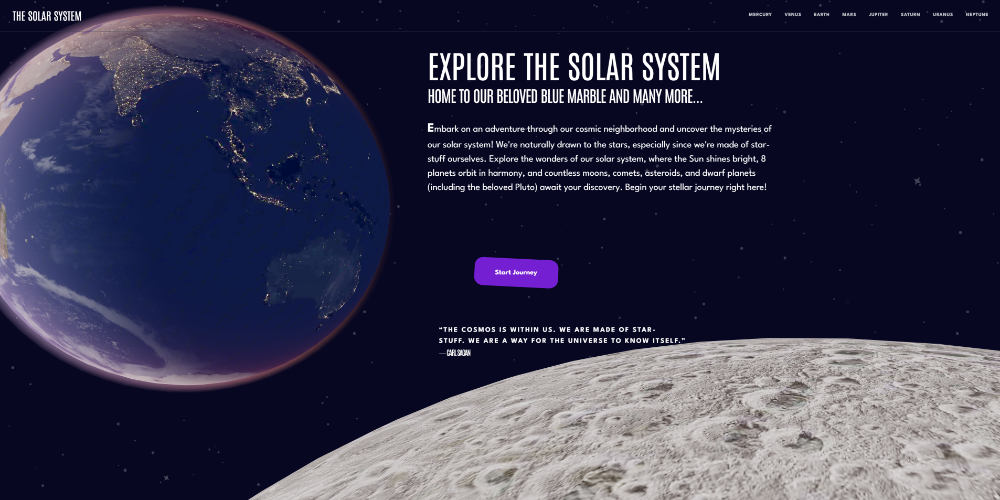
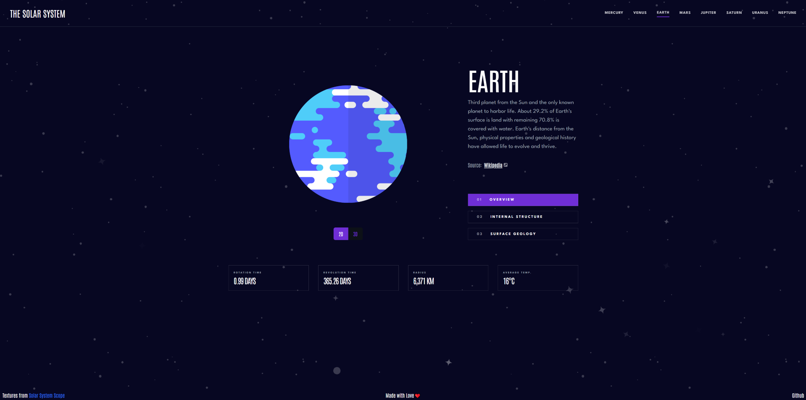
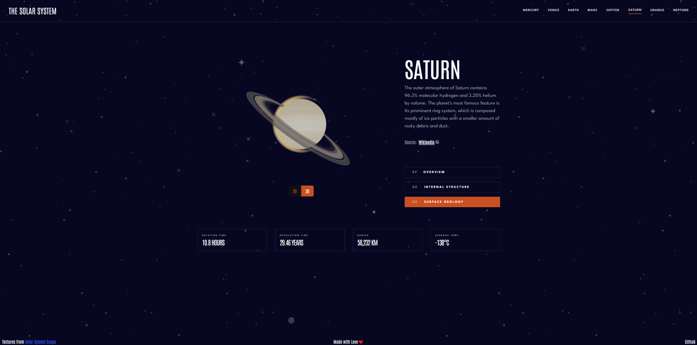

# Our Solar System

Welcome to  [Our Solar System!](https://our-solar-system.vercel.app) This project is an interactive website showcasing fascinating facts about the planets in our solar system.

## Technologies Used

* **Three.js** : A JavaScript library for creating 3D graphics in the browser.
* **React Three Fiber** : A React renderer for Three.js, enabling building scenes declaratively.
* **Next.js** : A React meta-framework for server-side rendering and static site generation and more...
* **Tailwind CSS** : A utility-first CSS framework for rapid UI development.

## Installation

To run this project locally, follow these steps:

**1.****Clone the Repository** :

```
git clone https://github.com/berke-bakar/our-solar-system.git
```

**2.****Navigate to the Project Directory** :

```
cd our-solar-system
```

**3.****Install Dependencies** :

```
npm install
```

**4.****Run the Development Server** :

```
npm run dev
```

**5.****Open Your Browser** and visit `http://localhost:3000` to view the site.


## Screenshots







## Credits

[Icon by smalllikeart](`https://www.freepik.com/icon/solar-system_885807#fromView=keyword&page=1&position=0&uuid=0ab49418-c8e7-4fc9-bfe6-6ae104f0b2af`)
